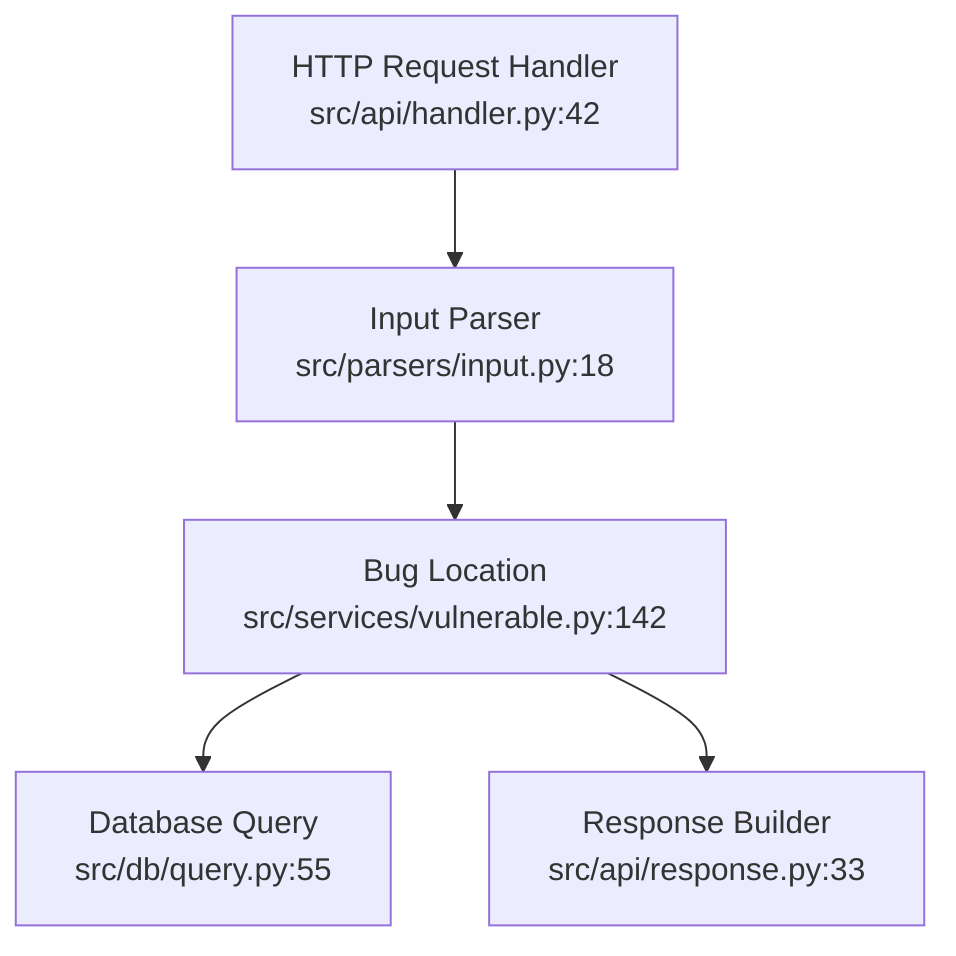

# BugSwarm GitHub Integration — Implementation Plan

## Executive Summary

This document outlines the architecture, implementation strategy, and rollout plan for making
BugSwarm a first-class citizen of the GitHub ecosystem. The integration spans GitHub App
registration, OAuth-based repository access, comprehensive webhook handling, Code Scanning
(SARIF) uploads, inline PR review comments, automated Issue creation, CI status checks,
a reusable GitHub Action, GitHub Marketplace listing, and enterprise-grade features
including self-hosted GitHub Enterprise Server support, organization-wide policies,
audit logging, and cost tracking.

**Target timeline:** 8 weeks, 2 engineers (one Rust backend, one Python/OAuth/Integration).
**Estimated code delta:** ~12,000 lines across 2 new crates, 1 new Python service, and
CI/CD configuration.

---

## 1. GitHub App Architecture

### 1.1 App Registration and Manifest

BugSwarm registers as a GitHub App (not an OAuth App). The distinction is critical:
GitHub Apps are first-class actors, can be installed on organizations, receive granular
permission scopes, and emit `check_suite` and `check_run` events that integrate natively
with the GitHub Checks API.

#### App Manifest (`bugswarm-github/manifest.json`):

```json
{
  "name": "BugSwarm",
  "url": "https://bugswarm.ai",
  "hook_attributes": {
    "url": "https://api.bugswarm.ai/github/webhooks"
  },
  "setup_url": "https://bugswarm.ai/github/setup",
  "redirect_url": "https://api.bugswarm.ai/github/oauth/callback",
  "description": "AI-powered bug discovery and vulnerability scanning for every commit.",
  "public": true,
  "default_permissions": {
    "contents": "read",
    "metadata": "read",
    "pull_requests": "write",
    "issues": "write",
    "checks": "write",
    "security_events": "write",
    "statuses": "write"
  },
  "default_events": [
    "pull_request.opened",
    "pull_request.synchronize",
    "pull_request.reopened",
    "push",
    "issues.opened",
    "check_suite.requested",
    "check_run.rerequested",
    "installation.created",
    "installation.deleted",
    "installation.suspend",
    "installation.unsuspend",
    "installation_repositories.added",
    "installation_repositories.removed"
  ]
}
```

#### Permission Rationale:

| Permission            | Scope          | Justification                                                                 |
|-----------------------|----------------|-------------------------------------------------------------------------------|
| `contents: read`      | Repository     | Clone and scan source code on push/PR events.                                 |
| `metadata: read`      | Repository     | Required by GitHub; grants access to repo metadata for display purposes.      |
| `pull_requests: write`| Repository     | Post inline review comments at exact lines where bugs are found.              |
| `issues: write`       | Repository     | Auto-create detailed bug reports when confirmed findings are detected.        |
| `checks: write`       | Repository     | Create check runs that appear as CI status checks in PRs.                     |
| `security_events: write` | Repository  | Upload SARIF files to GitHub Code Scanning.                                   |
| `statuses: write`     | Repository     | Set commit status (pending/success/failure) for branch protection rules.      |

#### Installation Flow:

1. User clicks "Install" from GitHub Marketplace or BugSwarm's landing page.
2. GitHub redirects to `setup_url` with `installation_id` query parameter.
3. BugSwarm's Python OAuth service exchanges the installation ID for an installation
   token via `POST /app/installations/{installation_id}/access_tokens`.
4. Token is stored encrypted in `bugswarm-github` crate's database alongside the
   installation metadata (org/user, selected repos, permissions granted).
5. GitHub sends `installation.created` webhook — BugSwarm verifies the payload HMAC
   signature, stores the installation record, and kicks off a background scan of
   the default branch for all selected repositories.

### 1.2 Webhook Handler Architecture

All webhooks arrive at a single endpoint: `POST /github/webhooks`.

The `bugswarm-github` crate (Rust, Actix-Web) implements:

```
bugswarm-github/
  src/
    webhook/
      mod.rs              # Webhook registry and dispatcher
      signature.rs        # HMAC-SHA256 verification
      event.rs            # Event type enum + serde deserialization
      handlers/
        pull_request.rs   # PR opened/synchronize/reopened
        push.rs           # Push to protected branches
        issues.rs         # Issue opened (auto-analyze)
        check_suite.rs    # Check suite requested
        check_run.rs      # Check run rerequested
        installation.rs   # Installation lifecycle events
    routes.rs             # Actix route definitions
    middleware/
      rate_limit.rs       # Per-installation rate limiting
      payload_guard.rs    # Payload size limits (max 25 MB)
```

#### Webhook Verification Pipeline:

```
┌──────────────────────────────────────────────────────────────┐
│  1. Extract X-Hub-Signature-256 from headers                  │
│  2. Extract X-GitHub-Event from headers                       │
│  3. Read raw body bytes                                       │
│  4. Compute HMAC-SHA256(body, app_webhook_secret)              │
│  5. Constant-time comparison with header signature             │
│  6. If mismatch → 401 Unauthorized + alert security channel   │
│  7. Deserialize event-specific payload                        │
│  8. Dispatch to typed handler                                 │
│  9. Handler returns 200 OK immediately (async processing)     │
│  10. Background task picks up work from internal queue         │
└──────────────────────────────────────────────────────────────┘
```

#### Rate Limiting Strategy:

- Per-installation sliding window: 100 requests/second.
- Per-repository: 50 requests/second (prevents abuse from large orgs).
- Global: 10,000 requests/minute across all installations.
- Excess requests return `429 Too Many Requests` with `Retry-After` header.
- Rate limit state stored in Redis with Lua scripts for atomicity.

---

## 2. OAuth Flow

### 2.1 Authorization Code Grant

BugSwarm uses the GitHub OAuth App flow for **user** authorization (distinct from
App installation). This allows individual users to grant BugSwarm access to their
private repositories without requiring org-wide App installation.

```
┌──────────────┐                                    ┌──────────────┐
│   BugSwarm   │                                    │    GitHub    │
│   Dashboard  │                                    │  OAuth App   │
└──────┬───────┘                                    └──────┬───────┘
       │                                                   │
       │  1. GET /github/authorize                         │
       │     ?client_id=BUGSWARM_CLIENT_ID                 │
       │     &scope=repo,user:email                        │
       │     &redirect_uri=https://api.bugswarm.ai/       │
       │       github/oauth/callback                       │
       │     &state=<random_csrf_token>                    │
       │──────────────────────────────────────────────────>│
       │                                                   │
       │  2. User authenticates and authorizes              │
       │<──────────────────────────────────────────────────│
       │                                                   │
       │  3. GitHub redirects to callback with             │
       │     ?code=<authorization_code>&state=<token>      │
       │<──────────────────────────────────────────────────│
       │                                                   │
       │  4. POST /login/oauth/access_token                │
       │     { client_id, client_secret, code, state }     │
       │──────────────────────────────────────────────────>│
       │                                                   │
       │  5. GitHub responds with access_token             │
       │<──────────────────────────────────────────────────│
       │                                                   │
       │  6. BugSwarm stores encrypted token               │
       │     for the authenticated user                    │
       │                                                   │
```

### 2.2 OAuth Service (`bugswarm-github-app/`)

Implemented in Python (FastAPI) for rapid iteration and because the OAuth flow is
callback-driven with minimal performance requirements:

```
bugswarm-github-app/
  src/
    __init__.py
    main.py                 # FastAPI application entrypoint
    config.py               # Environment-based configuration
    oauth/
      __init__.py
      router.py             # /github/authorize, /github/oauth/callback
      state.py              # CSRF state token generation/validation (Redis-backed)
      tokens.py             # Token encryption, refresh, revocation
      scopes.py             # Scope validation and expansion
    models/
      user.py               # User model (SQLAlchemy)
      github_connection.py  # GitHub OAuth connection (encrypted token storage)
    services/
      github_client.py      # PyGithub wrapper for user-token API calls
      repo_setup.py         # Post-auth: set up webhooks, create .github/bugswarm.yml
    templates/
      setup.html            # Post-installation setup page
    migrations/             # Alembic migrations for token storage table
```

#### Security Requirements:

- OAuth `state` parameter: 256-bit random value, HMAC-signed, 5-minute expiry.
- Access tokens encrypted at rest with AES-256-GCM; encryption key stored in Vault.
- Token refresh: proactive refresh 5 minutes before expiry using `POST /applications/{client_id}/token`.
- Revocation on user request: `DELETE /applications/{client_id}/grant` with the access token.
- Rate limit OAuth endpoints: 10 authorization attempts per IP per minute.

---

## 3. Webhook Events — Detailed Handler Specifications

### 3.1 `pull_request.opened` / `pull_request.synchronize`

**Trigger:** A new PR is opened or new commits are pushed to an existing PR.

**Processing Pipeline:**

```
pull_request event received
    │
    ▼
Extract: repo full_name, PR number, head SHA, base SHA, changed files
    │
    ▼
Create Check Run: POST /repos/{owner}/{repo}/check-runs
    name: "BugSwarm Security Scan"
    status: "queued"
    │
    ▼
Update Check Run: status: "in_progress"
    │
    ▼
Clone repository at head SHA (shallow clone, depth=1)
    │
    ▼
Compute diff: git diff base_sha..head_sha --name-only
    │
    ▼
Filter: only scan files matching configured patterns
    (default: *.py, *.js, *.ts, *.go, *.rs, *.java, *.c, *.cpp, *.rb, *.php)
    │
    ▼
For each changed file:
    ├── 1. Run BugSwarm investigation on the file diff
    ├── 2. If bug found → determine exact line in new version
    ├── 3. Generate SARIF result
    └── 4. Queue PR review comment for inline posting
    │
    ▼
Aggregate results:
    ├── Total files scanned
    ├── Bugs found (count by severity)
    ├── Scan duration
    └── SARIF file built for all results
    │
    ▼
Upload SARIF: POST /repos/{owner}/{repo}/code-scanning/sarifs
    │
    ▼
Post PR review: POST /repos/{owner}/{repo}/pulls/{number}/reviews
    body: Summary of findings
    comments: Inline comments at exact lines with finding details
    event: "REQUEST_CHANGES" if severity >= 7, else "COMMENT"
    │
    ▼
Update Check Run: status: "completed"
    conclusion: "failure" if severity >= 7 found, else "success" if scan completed
    output:
        title: "Found {N} potential bugs"
        summary: "| Severity | Count |\n|----------|-------|\n| Critical | 3 |..."
        annotations: Per-file findings
```

#### Changed-File Optimization:

To avoid re-scanning files that haven't changed since the last PR sync:

1. Compute SHA-256 of each changed file.
2. Look up SHA in `bugswarm_cache.scan_results` table.
3. If SHA matches a previous scan performed within the last 7 days, reuse cached results.
4. Cache hit → skip investigation, emit same findings with updated line numbers.
5. Cache TTL: 7 days for `main` branch scans, 24 hours for feature branch scans.

#### Performance Budget:

- Target: < 3 minutes for PRs with < 20 changed files.
- Maximum: 10 minutes for PRs with > 100 changed files (scan is aborted at 10-minute mark if
  not all files have been scanned; partial results are reported).
- Parallelism: scan up to 5 files concurrently using Tokio async tasks.

### 3.2 `push`

**Trigger:** Commits pushed to any branch.

**Logic:**

```
push event received
    │
    ▼
Check if branch matches protected branch pattern
    (configurable in .github/bugswarm.yml: protected_branches)
    (default: ["main", "master", "release/*", "production"])
    │
    ▼
If NOT a protected branch:
    → Skip. Return 200 OK.
    (Noise reduction: we don't want to scan every feature branch push)
    │
    ▼
If protected branch:
    → Determine if this is the first push or subsequent
    → First push: full repository scan (all files matching patterns)
    → Subsequent: range scan (git diff before..after)
    │
    ▼
Execute scan with same pipeline as PR (SARIF, issues, etc.)
    │
    ▼
Update commit status: POST /repos/{owner}/{repo}/statuses/{sha}
    state: "success" or "failure"
    context: "bugswarm/security-scan"
    description: "BugSwarm found N potential issues"
    target_url: "https://bugswarm.ai/scans/{scan_id}"
```

### 3.3 `issues.opened`

**Trigger:** A new GitHub Issue is created.

**Intelligent Bug Report Analysis:**

```
issues.opened event received
    │
    ▼
Extract: issue title, body (markdown), author, labels
    │
    ▼
Classification (BugSwarm fast classifier model):
    ├── Is this a bug report? (confidence score 0-1)
    ├── Is this a feature request? (0-1)
    ├── Is this a question/support request? (0-1)
    └── Is this spam/noise? (0-1)
    │
    ▼
If bug_report_confidence < 0.7:
    → Skip. Return 200 OK.
    │
    ▼
Extract structured information from issue body:
    ├── Stack trace? (regex patterns for Python, JS, Go, Rust, Java traces)
    ├── Reproduction steps? (numbered list detection)
    ├── Expected vs actual behavior? (section header detection)
    ├── Environment details? (OS, version, dependencies)
    └── Error messages? (quoted text, code blocks)
    │
    ▼
If reproduction steps found:
    → Feed into BugSwarm's reproduction engine
    → Attempt to generate a failing test case
    → Run against the referenced repository
    │
    ▼
If BugSwarm can reproduce:
    → Post comment on issue:
        "@{author} BugSwarm was able to confirm this issue.
         Here's a delta-debugged minimal reproduction:"
        [code block with minimal repro]
        "Affected code (from CPG call graph analysis):"
        [code references with line numbers]
    → Label issue: bugswarm:confirmed
    │
    ▼
If BugSwarm cannot reproduce:
    → Post comment:
        "@{author} BugSwarm couldn't automatically reproduce this issue.
         Could you provide a more specific reproduction case?"
    → Label issue: bugswarm:needs-info
```

#### CPG Call Graph Integration:

When a bug is confirmed, BugSwarm queries its Code Property Graph (CPG) to trace
the bug through the codebase:

1. Identify the function/file where the bug manifests.
2. Walk backward through the call graph to find callers.
3. Walk forward to find downstream effects.
4. Generate a Mermaid.js call graph diagram in the issue comment.
5. If the bug is part of an exploit chain: flag with `bugswarm:chain` label,
   include chain severity score, and link to chained vulnerabilities.

---

## 4. Code Scanning Integration (SARIF)

### 4.1 SARIF Output Format

SARIF (Static Analysis Results Interchange Format) is the standard format for
GitHub Code Scanning. BugSwarm converts its internal findings to SARIF v2.1.0.

#### Finding → SARIF Mapping:

```json
{
  "$schema": "https://json.schemastore.org/sarif-2.1.0.json",
  "version": "2.1.0",
  "runs": [
    {
      "tool": {
        "driver": {
          "name": "BugSwarm",
          "version": "1.0.0",
          "informationUri": "https://bugswarm.ai",
          "rules": [
            {
              "id": "BUGSWARM/SQL-INJECTION",
              "name": "SQL Injection",
              "shortDescription": {
                "text": "User input is concatenated into SQL query without parameterization."
              },
              "fullDescription": {
                "text": "A SQL injection vulnerability was detected where user-supplied input is directly interpolated into a SQL query string. This could allow attackers to execute arbitrary SQL commands."
              },
              "helpUri": "https://bugswarm.ai/docs/rules/SQL-INJECTION",
              "properties": {
                "bugswarm-severity": 9,
                "cwe": ["CWE-89"],
                "confidence": 0.92
              }
            }
          ]
        }
      },
      "results": [
        {
          "ruleId": "BUGSWARM/SQL-INJECTION",
          "ruleIndex": 0,
          "level": "error",
          "message": {
            "text": "SQL injection in `user_id` parameter. User input flows from request parameter to SQL query without sanitization."
          },
          "locations": [
            {
              "physicalLocation": {
                "artifactLocation": {
                  "uri": "src/api/users.py",
                  "uriBaseId": "%SRCROOT%"
                },
                "region": {
                  "startLine": 142,
                  "startColumn": 24,
                  "endLine": 142,
                  "endColumn": 58
                }
              }
            }
          ],
          "partialFingerprints": {
            "bugswarm/instance-id": "a1b2c3d4-e5f6-7890-abcd-ef1234567890"
          },
          "fixes": [
            {
              "description": {
                "text": "Use parameterized queries with SQLAlchemy ORM."
              },
              "artifactChanges": [
                {
                  "artifactLocation": {
                    "uri": "src/api/users.py"
                  },
                  "replacements": [
                    {
                      "deletedRegion": {
                        "startLine": 142,
                        "endLine": 142
                      },
                      "insertedContent": {
                        "text": "user = db.session.query(User).filter(User.id == user_id).first()"
                      }
                    }
                  ]
                }
              ]
            }
          ]
        }
      ],
      "artifacts": [
        {
          "location": {
            "uri": "src/api/users.py"
          },
          "sourceLanguage": "python"
        }
      ]
    }
  ]
}
```

#### Severity Mapping (BugSwarm → SARIF):

| BugSwarm Severity | SARIF Level | GitHub Alert Severity | Description                                |
|-------------------|-------------|-----------------------|--------------------------------------------|
| 9-10              | `error`     | Critical              | RCE, SQLi, auth bypass, data exfiltration  |
| 7-8               | `error`     | High                  | XSS, CSRF, path traversal, SSRF            |
| 5-6               | `warning`   | Medium                | Information disclosure, missing hardening  |
| 3-4               | `warning`   | Low                   | Code smell with security implications      |
| 1-2               | `note`      | Note                  | Best practice suggestions, documentation   |

#### SARIF Upload API:

```
POST /repos/{owner}/{repo}/code-scanning/sarifs
Authorization: Bearer <installation_token>
Content-Type: application/json

{
  "commit_sha": "abc123def456...",
  "ref": "refs/heads/main",
  "sarif": "<base64-encoded-gzipped-sarif>"
}
```

**Constraints enforced:**

- SARIF payload max 10 MB (GitHub limit).
- If payload exceeds 10 MB, split into multiple SARIF files and upload sequentially
  (GitHub Code Scanning deduplicates by `partialFingerprints`).
- Results are deduplicated within GitHub using `partialFingerprints.bugswarm/instance-id`.
  Changing code will produce a different fingerprint, so fixed bugs automatically
  disappear from the Security tab.

#### Alert Lifecycle:

1. SARIF uploaded → alert appears in Security → Code Scanning.
2. PR with fix merged → new SARIF uploaded on push to protected branch.
3. GitHub compares fingerprints; if the fingerprint from the previous alert is absent,
   the alert is automatically closed as "fixed."
4. If BugSwarm finds the same bug still present but at a different line, the
   fingerprint changes and a new alert is created (old one remains open until
   GitHub's 30-day staleness window expires).

---

## 5. PR Review Comments

### 5.1 Inline Comment Format

For each finding, BugSwarm posts a **pull request review** with inline comments
positioned at the exact line of code. This is done via:

```
POST /repos/{owner}/{repo}/pulls/{pull_number}/reviews
```

#### Review Body Template:

```markdown
## BugSwarm Scan Results

Scanned {N} files in {duration}s. Found {M} potential issues.

### Summary

| Severity | Count |
|----------|-------|
| Critical | 2     |
| High     | 1     |
| Medium   | 4     |
| Low      | 3     |
| Note     | 7     |

### Top Findings

1. **SQL Injection** in `src/api/users.py:142` (Critical)
    > User input flows from `request.args.get('user_id')` to SQL query
    without sanitization. See inline comment for details.

2. **Hardcoded Secret** in `src/config/database.py:23` (Critical)
    > Database password appears to be hardcoded in source code.

3. ...
```

#### Individual Inline Comment Template:

```markdown
**🐛 BugSwarm: {BUG_TYPE}** (Severity: {SEVERITY}/10, Confidence: {CONFIDENCE}%)

**What's wrong:**
{ONE_SENTENCE_EXPLANATION}

**Why it matters:**
{TWO_SENTENCE_IMPACT}

**How to fix:**
{ONE_PARAGRAPH_FIX_SUGGESTION}

**References:**
- [CWE-{CWE_ID}](https://cwe.mitre.org/data/definitions/{CWE_ID}.html)
- [BugSwarm Rule: {RULE_NAME}](https://bugswarm.ai/docs/rules/{RULE_ID})

<details>
<summary>Data flow trace</summary>

```
Source: {SOURCE_LOCATION}
  ↓
Sink: {SINK_LOCATION}
  ↓
Sanitizers: {NONE_OR_LIST}
```

{IF_EXPLOIT_CHAIN}
⚠️ **This bug is part of an exploit chain (severity {CHAIN_SEVERITY}/10).**
Combined with {OTHER_BUGS}, this could lead to {CHAIN_OUTCOME}.
</details>
```

#### Rate Limiting:

- Maximum 50 inline comments per review (GitHub API limit).
- If more than 50 findings, include top 50 in review, reference the rest with a
  link to the BugSwarm dashboard.
- Deduplication: if the same finding appears in multiple files (e.g., copy-pasted
  code), only comment once and note "also present in {other_file}:{line}."

---

## 6. Issue Auto-Creation

### 6.1 When Are Issues Created?

BugSwarm creates a GitHub Issue for each **confirmed** bug that meets these criteria:

1. Severity ≥ 5 (medium or above).
2. Confidence ≥ 0.80.
3. The bug is not already tracked by an open BugSwarm-created issue in the same repo
   (deduplication by `partialFingerprints`).
4. The bug is on the default branch or a protected branch (not on a transient feature
   branch unless the PR is merged).

### 6.2 Issue Template

```markdown
## 🐛 [{SEVERITY_LABEL}] {BUG_TYPE}: {ONE_LINE_SUMMARY}

**BugSwarm** automatically detected this issue during a {SCAN_TYPE} scan
of commit `{SHA}` on branch `{BRANCH}`.

---

### Severity Assessment

| Property      | Value        |
|---------------|--------------|
| Severity      | {SEVERITY}/10 |
| Confidence    | {CONFIDENCE}% |
| CWE           | [CWE-{CWE_ID}](https://cwe.mitre.org/data/definitions/{CWE_ID}.html) |
| Detectability | {EASY/MODERATE/HARD} |

### Affected Code

**File:** `{FILE_PATH}:{LINE}`
**Function:** `{FUNCTION_NAME}`

```{LANGUAGE}
{CODE_SNIPPET_WITH_HIGHLIGHTED_LINE}
```

### Reproduction Steps

{BugSwarm-generated minimal reproduction}

```{LANGUAGE}
{DELTA_DEBUGGED_MINIMAL_INPUT}
```

### Call Graph Analysis

The following Code Property Graph shows how this bug propagates through the codebase:



### Exploit Chain Context

{IF_PART_OF_CHAIN}
⚠️ **This vulnerability is part of an exploit chain.**

| Step | Description | File | Severity |
|------|-------------|------|----------|
| 1    | {CHAIN_STEP_1} | ... | {S} |
| 2    | **← This bug** | {FILE} | {S} |
| 3    | {CHAIN_STEP_3} | ... | {S} |

**Chain impact:** {CHAIN_IMPACT_DESCRIPTION}
**Combined severity:** {CHAIN_SEVERITY}/10

### Fix Suggestion

{FIX_SUGGESTION}

```diff
{FIX_DIFF}
```

---

<sub>🤖 Generated by [BugSwarm](https://bugswarm.ai) | [View full scan report](https://bugswarm.ai/scans/{SCAN_ID}) | [Configure scan settings]({REPO_URL}/settings/bugswarm)</sub>
```

### 6.3 Issue Labels

BugSwarm applies labels to auto-created issues:

- `bug` (GitHub's default)
- `bugswarm` (all auto-created issues)
- `bugswarm:severity-{severity_label}` (e.g., `bugswarm:severity-critical`)
- `bugswarm:confidence-{confidence_label}` (e.g., `bugswarm:confidence-high`)
- `bugswarm:chain` (if part of exploit chain)
- `bugswarm:{bug_type_slug}` (e.g., `bugswarm:sql-injection`)

### 6.4 Issue Management

- **Auto-close:** When a fix is detected for the same fingerprint, BugSwarm comments
  "This issue appears to be fixed in commit {SHA}" and closes the issue.
- **Stale management:** If an issue remains open for 90 days without activity and the
  code hasn't changed, BugSwarm comments a reminder and adds the `bugswarm:stale` label.
  After 180 days, the issue is auto-closed.
- **User feedback loop:** Users can react with 👍 (confirmed) or 👎 (false positive)
  on BugSwarm's issue comment. This feedback is ingested into BugSwarm's training
  pipeline to improve accuracy.

---

## 7. Status Checks (CI Integration)

### 7.1 Check Runs API

BugSwarm uses the GitHub Checks API to appear as a CI check on every PR:

#### Check Run Lifecycle:

```
┌──────────────┐
│    queued    │  ← Initial state when webhook is received
└──────┬───────┘
       │
       ▼
┌──────────────┐
│ in_progress  │  ← Set when scan actually starts processing
└──────┬───────┘
       │
       ├── (optional) scan takes < 60 seconds
       │
       ▼
┌──────────────┐
│  completed   │  ← Final state
│  conclusion: │
│  - success   │     No bugs found OR all bugs below configured threshold
│  - failure   │     Bugs found at or above threshold
│  - neutral   │     Scan skipped (e.g., no supported files changed)
│  - cancelled │     Scan aborted (timeout, blacklisted file, etc.)
│  - skipped   │     Branch not in scan scope
│  - timed_out │     Scan exceeded time budget
│  - action_required │  Critical bugs found requiring immediate attention
└──────────────┘
```

#### Check Run Output:

```json
{
  "name": "BugSwarm Security Scan",
  "head_sha": "abc123def456",
  "status": "completed",
  "conclusion": "failure",
  "completed_at": "2025-06-15T14:30:00Z",
  "output": {
    "title": "Found 5 potential security issues",
    "summary": "BugSwarm scanned 23 files and found 5 potential issues:\n\n- **2 critical** (SQL injection, hardcoded secret)\n- **1 high** (XSS in user input rendering)\n- **2 medium** (missing CSRF token, insecure cookie settings)\n\n[View detailed report on BugSwarm](https://bugswarm.ai/scans/abc-123)",
    "text": "... detailed markdown report ...",
    "annotations": [
      {
        "path": "src/api/users.py",
        "start_line": 142,
        "end_line": 142,
        "annotation_level": "failure",
        "message": "SQL Injection: user input concatenated into SQL query",
        "title": "SQL Injection",
        "raw_details": "..."
      },
      {
        "path": "src/config/database.py",
        "start_line": 23,
        "end_line": 23,
        "annotation_level": "failure",
        "message": "Hardcoded database password",
        "title": "Hardcoded Secret",
        "raw_details": "..."
      }
    ]
  }
}
```

#### Annotation Limits:

- Maximum 50 annotations per check run (GitHub API limit).
- Annotations beyond limit are summarized in `output.text` with file/line references.
- `annotation_level` mapping: BugSwarm severity 7-10 → `failure`, 4-6 → `warning`, 1-3 → `notice`.

### 7.2 Branch Protection Integration

Repository administrators can configure branch protection rules to **require** the
BugSwarm check to pass before a PR can be merged:

1. **GitHub UI path:** Settings → Branches → Branch protection rules → Add rule.
2. Check "Require status checks to pass before merging."
3. Search for "BugSwarm Security Scan" in the status check list.
4. Enable the check.

When configured:

- PRs with BugSwarm findings (check conclusion: `failure`) **cannot be merged**
  unless the repository admin overrides.
- PRs where BugSwarm skipped (no supported files) are **not blocked**.
- PRs where BugSwarm timed out show a warning but are **not blocked** by default
  (configurable in `.github/bugswarm.yml`).

---

## 8. GitHub Actions

### 8.1 `bugswarm-action@v1`

A reusable GitHub Action that any repository can add to their workflow with a single line:

```yaml
name: CI

on:
  pull_request:
    branches: [main, master]
  push:
    branches: [main, master, release/*]

jobs:
  bugswarm:
    runs-on: ubuntu-latest
    steps:
      - uses: actions/checkout@v4
      - uses: bugswarm/bugswarm-action@v1
        with:
          api_key: ${{ secrets.BUGSWARM_API_KEY }}
          fail_on: 'high'  # optional: 'critical', 'high', 'medium', 'low', 'never'
          max_minutes: 10   # optional: time budget
          paths: 'src/,lib/' # optional: restrict scan to specific paths
```

#### Action Implementation (`action.yml`):

```yaml
name: 'BugSwarm Security Scan'
description: 'AI-powered bug discovery and vulnerability scanning'
author: 'BugSwarm'
branding:
  icon: 'shield'
  color: 'red'

inputs:
  api_key:
    description: 'BugSwarm API key'
    required: true
  fail_on:
    description: 'Minimum severity to fail the check'
    required: false
    default: 'high'
  max_minutes:
    description: 'Maximum scan duration in minutes'
    required: false
    default: '10'
  paths:
    description: 'Comma-separated paths to scan'
    required: false
    default: '.'
  sarif_upload:
    description: 'Upload results as SARIF to GitHub Code Scanning'
    required: false
    default: 'true'
  pr_comment:
    description: 'Post findings as PR review comments'
    required: false
    default: 'true'
  config_file:
    description: 'Path to BugSwarm configuration file'
    required: false
    default: '.github/bugswarm.yml'

runs:
  using: 'composite'
  steps:
    - name: Download BugSwarm CLI
      run: |
        curl -sSL https://get.bugswarm.ai/cli/latest/linux-amd64 -o /usr/local/bin/bugswarm
        chmod +x /usr/local/bin/bugswarm
      shell: bash

    - name: Run BugSwarm Scan
      id: scan
      run: |
        bugswarm scan \
          --api-key "${{ inputs.api_key }}" \
          --paths "${{ inputs.paths }}" \
          --fail-on "${{ inputs.fail_on }}" \
          --max-minutes "${{ inputs.max_minutes }}" \
          --config "${{ inputs.config_file }}" \
          --format sarif \
          --output bugswarm-results.sarif \
          --format json \
          --output bugswarm-results.json
      shell: bash

    - name: Upload SARIF to GitHub Code Scanning
      if: inputs.sarif_upload == 'true'
      uses: github/codeql-action/upload-sarif@v3
      with:
        sarif_file: bugswarm-results.sarif
        category: bugswarm

    - name: Post PR Comment
      if: github.event_name == 'pull_request' && inputs.pr_comment == 'true'
      uses: actions/github-script@v7
      with:
        script: |
          const fs = require('fs');
          const results = JSON.parse(fs.readFileSync('bugswarm-results.json', 'utf8'));
          // Post findings as PR review...
```

### 8.2 Per-Repository Configuration (`.github/bugswarm.yml`)

Repositories can configure BugSwarm behavior without modifying their CI workflows:

```yaml
# .github/bugswarm.yml — BugSwarm configuration for this repository

version: '1'

# Scan rules
scan:
  # File patterns to include/exclude
  include:
    - 'src/**/*.py'
    - 'src/**/*.js'
    - 'src/**/*.ts'
    - 'lib/**/*.py'
    - 'lib/**/*.go'
  exclude:
    - '**/test_*.py'
    - '**/*_test.go'
    - '**/test/**'
    - '**/tests/**'
    - '**/vendor/**'
    - '**/node_modules/**'
    - '**/migrations/**'
    - '**/__pycache__/**'

  # Branches to scan on push
  protected_branches:
    - 'main'
    - 'master'
    - 'release/*'
    - 'production'

  # Minimum severity to fail check/block merge
  fail_on: 'high'

  # Time budget
  max_scan_minutes: 10

# Issue creation
issues:
  auto_create: true
  auto_close_on_fix: true
  min_severity: 'medium'
  min_confidence: 0.80
  stale_days: 90
  auto_close_stale_days: 180
  labels:
    add:
      - 'security'
      - 'bugswarm'
    remove_on_fix:
      - 'bugswarm:stale'

# PR review comments
pr_review:
  enabled: true
  max_comments: 50
  event_on_critical: 'REQUEST_CHANGES'  # or 'COMMENT'
  event_on_non_critical: 'COMMENT'

# Code Scanning (SARIF)
code_scanning:
  upload_sarif: true
  # Map BugSwarm severities to GitHub Code Scanning severities
  severity_mapping:
    critical: 'error'
    high: 'error'
    medium: 'warning'
    low: 'warning'
    note: 'note'

# CI check
ci_check:
  enabled: true
  check_name: 'BugSwarm Security Scan'

# Notification settings
notifications:
  slack:
    webhook_url: '${{ secrets.BUGSWARM_SLACK_WEBHOOK }}'
    on_critical: true
    on_high: false
    channel: '#security-alerts'

# Rule overrides (per-repo)
rules:
  ignore:
    - 'BUGSWARM/HARDCODED-SECRET'  # Rule ID to suppress
    - 'BUGSWARM/UNUSED-VARIABLE'
  custom_severity:
    'BUGSWARM/SQL-INJECTION': 'critical'  # Override default severity
    'BUGSWARM/HARDCODED-SECRET': 'high'

# LLM configuration (if using custom model)
llm:
  provider: 'default'  # or 'openai', 'anthropic', 'deepseek'
  model: ''  # blank = auto-select
  investigation_model: 'bugswarm-investigator-v2'
  judge_model: 'bugswarm-judge-v3'

# Exploit chain detection
exploit_chain:
  enabled: true
  min_chain_length: 2
  max_chain_depth: 5
  chain_severity_threshold: 'high'

# Budget
budget:
  max_cost_per_scan_usd: 1.00
  max_cost_per_month_usd: 500.00
```

---

## 9. GitHub Marketplace Listing

### 9.1 Listing Requirements

To be listed on the GitHub Marketplace, BugSwarm must:

1. **Create a listing draft** in the GitHub Marketplace section of the BugSwarm GitHub App.
2. **Pass GitHub's review process**, which checks:
   - The app uses appropriate permissions (principle of least privilege).
   - The app's description is accurate and not misleading.
   - Webhook handling is reliable and properly verified.
   - The app has a privacy policy and terms of service.
   - The app has a mechanism for users to revoke access.
3. **Pricing plan** (if applicable):
   - Free tier: public repositories, 500 scans/month.
   - Team tier: $29/month, unlimited public repos, 2 private repos.
   - Business tier: $99/month, unlimited repos, advanced exploit chain detection.
   - Enterprise tier: custom pricing, on-premise, SSO, audit logs.

### 9.2 Marketplace Assets

| Asset          | Specification                              |
|----------------|--------------------------------------------|
| Logo           | 512x512 PNG, transparent background        |
| Banner         | 1200x630 PNG                               |
| Screenshots    | 4-6 images showing PR comment, Security tab, Dashboard |
| Description    | 400-4000 characters, markdown              |
| Category       | "Code review" + "Security"                 |

### 9.3 Marketplace Webhook

GitHub sends `marketplace_purchase` events when users subscribe/unsubscribe:

```
marketplace_purchase.purchased    → Provision access, send welcome email
marketplace_purchase.changed      → Upgrade/downgrade plan, adjust limits
marketplace_purchase.cancelled    → Schedule access revocation at period end
marketplace_purchase.pending_change → Notify user of upcoming plan change
```

---

## 10. Enterprise Features

### 10.1 GitHub Enterprise Server (GHES) Support

For organizations running GitHub Enterprise Server (self-hosted):

- **URL configuration:** BugSwarm must support custom GitHub API base URLs
  (e.g., `https://github.mycompany.com/api/v3`). This is configured per installation
  in the `installations` database table.
- **Webhook delivery:** GHES may be behind a firewall. BugSwarm supports:
  - **Option A (Push):** GHES has outbound internet access → webhooks sent to
    `https://api.bugswarm.ai/github/webhooks` as normal.
  - **Option B (Pull):** GHES is fully air-gapped → BugSwarm provides a lightweight
    **on-premise webhook relay** that polls GHES for new events via `GET /repos/{owner}/{repo}/events`
    and forwards them to BugSwarm's cloud API.
- **API compatibility:** BugSwarm's Rust crate uses the `octocrab` library which supports
  custom base URLs. All API calls go through a `GitHubClient` struct that resolves
  the base URL from the installation record.
- **Rate limiting:** GHES has different rate limits than github.com. BugSwarm queries
  `GET /rate_limit` on startup and adapts its rate limiter accordingly.
- **Certificate management:** For self-signed certificates, administrators can upload
  a CA bundle via the BugSwarm dashboard, stored encrypted.

### 10.2 Organization-Wide Policy

Enterprise organizations can enforce mandatory BugSwarm scans on all repositories:

```yaml
# Organization-level policy (configured in BugSwarm dashboard)
policy:
  org_id: "acme-corp"

  mandatory_scanning:
    enabled: true
    applies_to: "all_repos"  # or "selected_repos"
    exempt_repos:
      - "acme-corp/docs"
      - "acme-corp/website"

  requires:
    pass_on_critical: true    # Block merge if critical bugs
    pass_on_high: true        # Block merge if high-severity bugs
    pass_on_medium: false     # Warn only (don't block)

  scan_schedule:
    full_scan: "0 2 * * 0"   # Weekly full scan on Sunday at 2 AM
    incremental: "0 */6 * * *" # Every 6 hours

  enforcement:
    block_force_push: true
    disable_merge_without_check: true
```

When an organization-wide policy is active:
1. BugSwarm listens for `repository.created` events across the org.
2. New repos automatically get BugSwarm's App installed (if not already).
3. A `.github/bugswarm.yml` is committed to the repo's default branch via the API.
4. Branch protection rules are configured via `PUT /repos/{owner}/{repo}/branches/{branch}/protection`.

### 10.3 Audit Log

Every BugSwarm action is logged for enterprise compliance:

```
bugswarm_audit_log table:
  id              UUID PRIMARY KEY
  timestamp       TIMESTAMPTZ NOT NULL
  installation_id INTEGER NOT NULL
  repository      TEXT NOT NULL
  event_type      TEXT NOT NULL   -- 'scan.started', 'scan.completed', 'issue.created', etc.
  actor           TEXT            -- GitHub user who triggered the action
  scan_id         UUID
  details         JSONB           -- Full event payload
  severity        INTEGER         -- Highest severity found (if applicable)
  findings_count  INTEGER         -- Number of findings
  duration_ms     INTEGER         -- Scan duration
  cost_estimate   NUMERIC(10,6)   -- Estimated API cost
  token_usage     JSONB           -- {prompt_tokens, completion_tokens, provider}
```

#### Audit Log Queries (available in enterprise dashboard):

```sql
-- Total scans per repo in last 30 days
SELECT repository, COUNT(*) as scan_count
FROM bugswarm_audit_log
WHERE event_type = 'scan.completed'
  AND timestamp > NOW() - INTERVAL '30 days'
GROUP BY repository
ORDER BY scan_count DESC;

-- Users who triggered the most scans
SELECT actor, COUNT(*) as trigger_count
FROM bugswarm_audit_log
WHERE event_type = 'scan.started'
  AND timestamp > NOW() - INTERVAL '30 days'
GROUP BY actor
ORDER BY trigger_count DESC;

-- Average cost per scan by repo
SELECT repository,
  AVG(cost_estimate) as avg_cost,
  SUM(cost_estimate) as total_cost
FROM bugswarm_audit_log
WHERE event_type = 'scan.completed'
  AND timestamp > NOW() - INTERVAL '30 days'
GROUP BY repository;

-- Findings by severity over time (trend)
SELECT
  DATE_TRUNC('day', timestamp) as day,
  severity,
  SUM(findings_count) as total_findings
FROM bugswarm_audit_log
WHERE event_type = 'scan.completed'
  AND timestamp > NOW() - INTERVAL '90 days'
GROUP BY day, severity
ORDER BY day DESC, severity DESC;
```

### 10.4 Cost Tracking

Enterprise customers receive granular cost breakdowns:

| Metric                    | Tracking Mechanism                                 |
|---------------------------|---------------------------------------------------|
| LLM API tokens per scan   | Logged in `token_usage` JSONB field                |
| Provider cost per 1M tokens | Stored in provider configuration; updated weekly |
| Total cost per scan       | `prompt_tokens * prompt_rate + completion_tokens * completion_rate` |
| Cost per repo/month       | Aggregated from audit log                          |
| Cost per org/month        | Sum of all repo costs                              |
| Cost per user/month       | Tracked by `actor` field in audit log             |

Cost data is exposed:
- In the enterprise dashboard as charts and tables.
- Via API: `GET /api/v1/enterprise/{org_id}/costs?from=2025-01-01&to=2025-01-31`.
- As CSV export for accounting integration.
- As automated monthly email reports to billing contacts.

---

## 11. Architecture: New Crates and Services

### 11.1 Rust Crate: `bugswarm-github/`

The core webhook handler and GitHub API integration, built in Rust for performance
and reliability.

```
bugswarm-github/
  Cargo.toml
  src/
    lib.rs                     # Crate root, re-exports
    main.rs                    # Binary entrypoint (Actix-Web server)

    config.rs                  # Configuration from env/files
                               # - GitHub App ID, private key path, webhook secret
                               # - Database URL, Redis URL
                               # - Rate limit defaults

    app.rs                     # GitHubApp struct
                               # - JWT generation (app authentication)
                               # - Installation token caching
                               # - Token refresh (tokens expire in 1 hour)
                               # - Rate limit tracking per installation

    db/
      mod.rs                   # Database module
      models.rs                # SQLx models:
                               #   - installations (id, account, repos, permissions)
                               #   - scan_results (sha, repo, findings, sarif, timestamp)
                               #   - issue_tracking (repo, fingerprint, github_issue_id)
                               #   - audit_log (as described above)
                               #   - webhook_deliveries (id, event, payload, status, timestamp)
      migrations/              # SQLx migrations
        V1__initial.sql
        V2__add_audit_log.sql
        V3__add_cost_tracking.sql

    webhook/
      mod.rs                   # WebhookRegistry — maps event types to handlers
      signature.rs             # verify_signature(body, secret, signature_header) -> Result<()>
      event.rs                 # Event enum with all handled event types
      handlers/
        mod.rs                 # Re-exports
        pull_request.rs         # Handler for pull_request.* events
        push.rs                 # Handler for push events
        issues.rs               # Handler for issues.* events
        check_suite.rs          # Handler for check_suite.* events
        check_run.rs            # Handler for check_run.* events
        installation.rs         # Handler for installation.* events
        marketplace.rs          # Handler for marketplace_purchase.* events

    github_api/
      mod.rs                   # GitHub API client wrapper
      client.rs                # Octocrab wrapper with installation token auth
      checks.rs                # Check Runs API (create, update, complete)
      comments.rs              # PR review comments API
      issues.rs                # Issue creation API
      sarif.rs                 # SARIF upload API
      statuses.rs              # Commit status API
      repos.rs                 # Repository API (clone, branch protection)
      rate_limit.rs            # Rate limit querying

    sarif/
      mod.rs                   # SARIF builder
      builder.rs               # Build SARIF v2.1.0 from BugSwarm findings
      rules.rs                 # BugSwarm rule → SARIF rule mapping
      severity.rs              # Severity mapping (BugSwarm 1-10 → error/warning/note)

    scan/
      mod.rs                   # Scan orchestration
      orchestrator.rs          # ScanOrchestrator:
                               #   - Accepts ScanRequest (repo, sha, files, config)
                               #   - Clones repo (or uses cache)
                               #   - Invokes BugSwarm engine
                               #   - Aggregates findings
                               #   - Uploads SARIF
                               #   - Posts PR review
                               #   - Creates issues
                               #   - Updates check run
                               #   - Emits audit log events
      file_cache.rs            # SHA-256 based scan result cache
      queue.rs                 # Redis-backed work queue for async scan jobs

    config_file/
      mod.rs                   # .github/bugswarm.yml parser
      parser.rs                # YAML deserialization + validation
      schema.rs                # Config struct (typed representation of YAML schema)

    enterprise/
      mod.rs                   # Enterprise-specific features
      org_policy.rs             # Organization-wide policy enforcement
      ghes.rs                  # GitHub Enterprise Server compatibility
      audit.rs                 # Audit log query API
      cost_tracking.rs         # Cost aggregation and reporting

    action_integration/
      mod.rs                   # GitHub Actions integration
      action_runner.rs         # Logic shared with bugswarm-action@v1
      environment.rs           # Detect if running in GitHub Actions environment
```

### 11.2 Python Service: `bugswarm-github-app/`

The OAuth service and setup flow, built in Python (FastAPI):

```
bugswarm-github-app/
  pyproject.toml
  Dockerfile
  src/
    bugswarm_github_app/
      __init__.py
      main.py

      config.py                 # Pydantic Settings from environment

      api/
        __init__.py
        router.py               # Main API router
        v1/
          __init__.py
          router.py             # API v1 router
          health.py             # /health endpoint
          setup.py              # /setup endpoint (post-install web UI)
          dashboard.py          # /dashboard/{org} — repo overview

      oauth/
        __init__.py
        router.py               # /github/authorize, /github/oauth/callback
        state.py                # CSRF state token generation and validation
        tokens.py               # Token encryption, storage, refresh
        github_app.py           # GitHub App JWT generation and installation token exchange

      models/
        __init__.py
        base.py                 # SQLAlchemy Base
        user.py                 # User table
        github_connection.py    # OAuth token storage (encrypted)
        github_installation.py  # App installation metadata

      services/
        __init__.py
        github_client.py        # HTTPX-based GitHub API client
        repo_setup.py           # Post-install: add .github/bugswarm.yml, configure branch protection
        onboarding.py           # Step-by-step onboarding wizard for new users
        marketplace.py          # Subscription management (plan changes, cancellations)

      templates/
        setup/
          index.html            # Post-installation setup page
          success.html          # Setup complete
          error.html            # Setup error
          org_select.html       # Organization selection for app install
        dashboard/
          overview.html         # Repo scan overview
          scan.html             # Individual scan results
          settings.html         # Repo configuration editor

      background/
        __init__.py
        tasks.py                # Celery/ARQ background tasks
        scan_trigger.py         # Schedule full repo scans for new installations
        webhook_register.py     # Register/unregister webhooks on GHES instances

    tests/
      __init__.py
      conftest.py               # Pytest fixtures (mock GitHub API)
      test_oauth.py
      test_setup.py
      test_marketplace.py
      test_repo_setup.py

    migrations/
      alembic.ini
      env.py
      versions/
        001_initial.py
        002_add_gh_installations.py
        003_add_marketplace.py
```

---

## 12. Implementation Timeline (8 Weeks, 2 Engineers)

```
Week 1-2: Foundation
──────────────────────────────────────────────────────
Engineer A (Rust):
  - Set up bugswarm-github crate skeleton (Actix-Web, SQLx, Redis)
  - Implement App authentication (JWT generation, installation tokens)
  - Implement webhook signature verification
  - Implement webhook event router and first handler (installation.created)
  - Database schema design and migrations
  Rate limit middleware

Engineer B (Python/OAuth):
  - Set up bugswarm-github-app FastAPI service
  - GitHub App manifest and registration
  - OAuth authorization flow (authorize → callback → token exchange)
  - CSRF state management with Redis
  - Token encryption and storage
  - Post-install setup page (Jinja2 templates)

Week 3-4: Core Webhook Handlers
──────────────────────────────────────────────────────
Engineer A (Rust):
  - pull_request.opened / synchronize handler (full pipeline)
  - push handler (protected branch logic)
  - Check Runs API integration (create, update, complete)
  - PR review comment posting (inline comments)
  - SARIF builder: convert BugSwarm findings → SARIF v2.1.0
  - SARIF upload to GitHub Code Scanning

Engineer B (Python/OAuth):
  - issues.opened handler (bug report classifier, structured extraction)
  - Issue auto-creation with templates
  - CPG call graph integration for issue enrichment
  - Exploit chain detection label propagation
  - .github/bugswarm.yml parser and config service

Week 5-6: Integration & Polish
──────────────────────────────────────────────────────
Engineer A (Rust):
  - check_suite.requested and check_run.rerequested handlers
  - Scan result caching (SHA-256 based dedup)
  - Branch protection integration (auto-configure protection rules)
  - Commit status updates
  - Performance optimization (parallel scanning, connection pooling)

Engineer B (Python/OAuth):
  - Dashboard UI (repo overview, scan results, settings)
  - Organization-wide policy management
  - Audit log query API and dashboard widgets
  - Cost tracking aggregation and reporting
  - Marketplace purchase webhook handling
  - Onboarding wizard

Week 7: GitHub Actions & Marketplace
───────────────────────────────────────────────────
Engineer A (Rust):
  - bugswarm-action@v1 implementation (composite action)
  - Test action against sample repositories
  - Action documentation and examples
  - Environment detection (GITHUB_EVENT_NAME, GITHUB_REPOSITORY)

Engineer B (Python/OAuth):
  - GitHub Marketplace listing creation
  - Screenshots, description, branding assets
  - Pricing plans configuration
  - App review submission preparation
  - Privacy policy and terms of service pages

Week 8: Enterprise, Testing, Deployment
───────────────────────────────────────────────────
Engineer A (Rust):
  - GitHub Enterprise Server support (custom base URLs)
  - Air-gapped relay agent for GHES on-premise
  - Integration tests with recorded webhook payloads
  - Load testing (100 repositories × 10 PRs/minute)
  - Docker image for bugswarm-github service
  - Kubernetes manifests

Engineer B (Python/OAuth):
  - SSO integration for enterprise (SAML/OIDC via GitHub)
  - Audit log CSV export
  - Monthly cost report email
  - Documentation: integration guide, API reference, troubleshooting
  - Migration scripts for existing BugSwarm users
  - End-to-end testing with live GitHub test org

Week 9+: Post-Launch
──────────────────────────────────────────────────────
  - GitHub Marketplace review process (2-4 weeks typical)
  - Production monitoring and alerting
  - Webhook delivery troubleshooting
  - User feedback collection and prioritization
  - Performance tuning based on real-world usage
```
